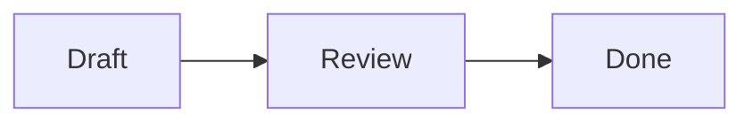

# Mermaid diagram example

This diagram stays portable Markdown. Enable **Mermaid diagrams** in
**Settings → Plugins** to render it in Rich view. **Show diagram source** keeps
the exact fenced source available.

The optional plugin works locally and offline. If it is disabled or the diagram
is invalid, Denote shows an ordinary fenced code block instead.

#guide #example #diagram
