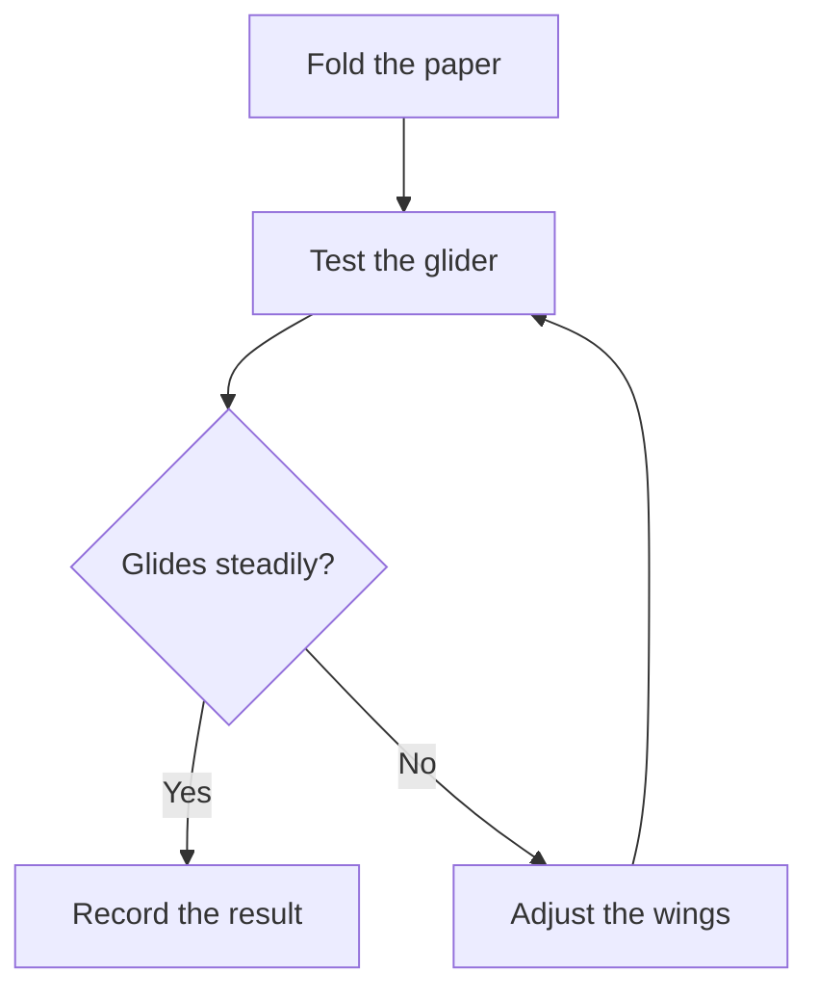

# Paper glider flow

Enable **Mermaid diagrams** and open this note in **Rich** view. The diagram
shows a small decision loop; **Show diagram source** keeps its fence editable.

Change a label in the source and return to the diagram. No links, scripts,
external assets, or custom styles are needed. Without the plugin, the same
fence remains readable code.
